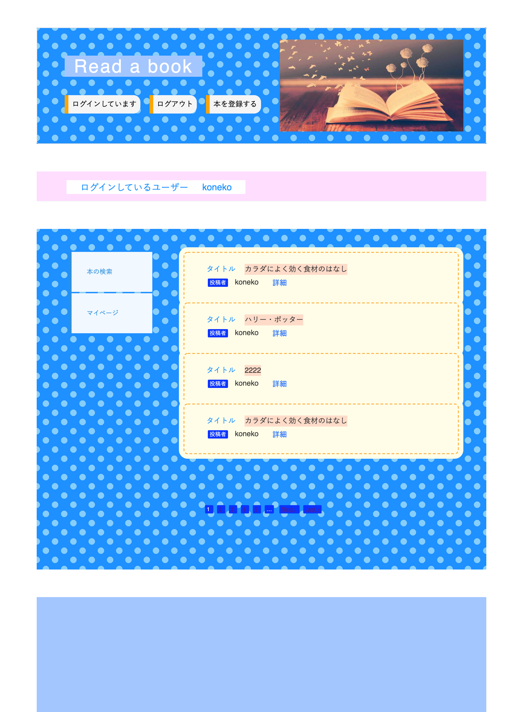

# README

# Read a book(リード　ア　ブック)
# https://whispering-anchorage-37648.herokuapp.com/ (heroku)

# 概要
*
*
*
# バージョン情報
* Ruby 2.5.1
* Rails 5.2.4.1
# 機能一覧

- [ ] 新規登録機能
- [ ] ログイン機能
- [ ] ユーザーデータ編集機能
- [ ] 本のデータ登録機能
- [ ] 登録した本の詳細確認機能
- [ ] プロフィール登録機能
- [ ] ページネーション機能
- [ ] 本の検索サイトへのリンク

# 使用gem一覧
## 新規登録、ログイン機能
* device
## ページネーション機能
* kaminari
## デバックツール
* pry-rails
## デフォルトの言語を日本語に設定する
* i18n
## ビューテンプレートエンジン
*  Haml
## アイコンをヘルパーメソッドで導入
* fontawsome
## 画像のアップロード
* carrierwave
* mini_magick
## テストコード
* rspec-rails
* web-console
* factory_bot
# セットアップ
*
*
