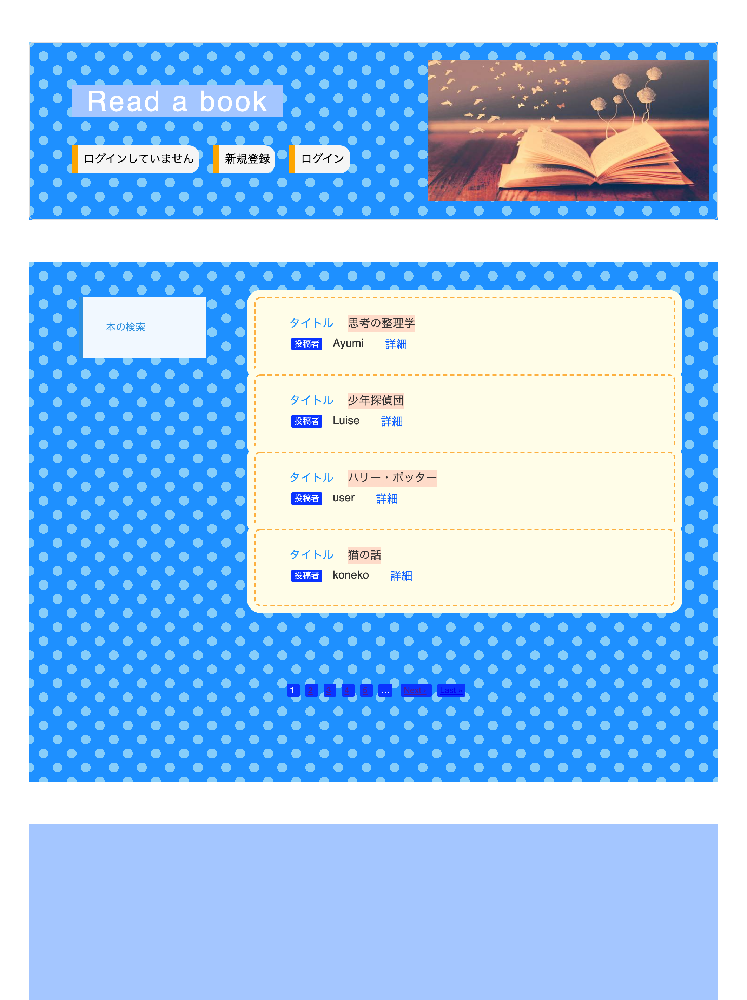
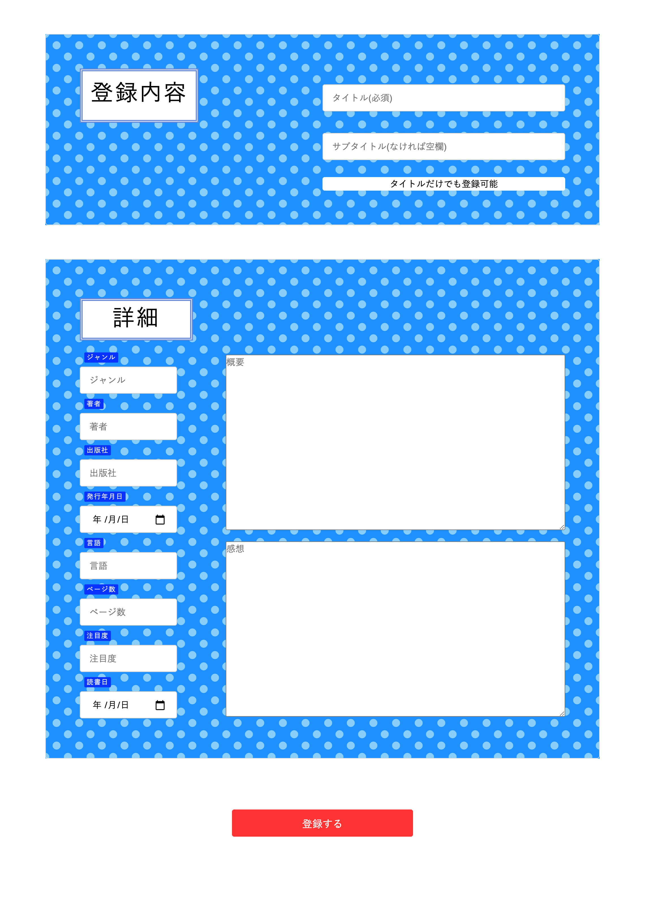

# README

# Read a book(リード　ア　ブック)
# https://whispering-anchorage-37648.herokuapp.com/ (heroku)
herokuでデプロイしていますが、現在本番環境上でHTTP ERROR400のエラーが出ており本の登録とプロフィールの登録が出来ません。

解決する為色々試していますが、現在AWSでデプロイし直しを検討中です。

新規登録、ログイン、本の検索機能は利用できます。

以下、本番環境での仮ログイン時入力データ

仮ニックネーム nekoneko

仮メールアドレス test@gmail.com

仮パスワード　koneko25

# 概要
* オススメの本を投稿してユーザー同士共有し、交流するアプリ。
* 本について楽しく語り合うことで、読書が苦手な人も好きになる、楽しくなることを目指します。
# バージョン情報
* Ruby 2.5.1
* Rails 5.2.4.1
# 機能一覧

- [ ] 新規登録機能
- [ ] ログイン機能
- [ ] ユーザーデータ編集機能
- [ ] 本のデータ登録機能
- [ ] 登録した本の詳細確認機能
- [ ] プロフィール登録機能
- [ ] ページネーション機能
- [ ] 本の検索サイトへのリンク

## 実装中の機能一覧

- [ ] 本のデータ編集機能
- [ ] 本のデータ削除機能

## 登録予定の機能一覧

- [ ] コメント機能
- [ ] いいね機能
- [ ] 本のデータ検索機能
- [ ] 画像登録機能

# データベース設計
https://docs.google.com/document/d/13hudxsdf7nURaWKa4dGSL11XlkaiEhPN_79nBJwhIUw/edit#heading=h.dezakegwwh22

# ER図

# 使用gem一覧
## 新規登録、ログイン機能
* device
## ページネーション機能
* kaminari
## デバックツール
* pry-rails
## デフォルトの言語を日本語に設定する
* i18n
## ビューテンプレートエンジン
*  Haml
## アイコンをヘルパーメソッドで導入
* fontawsome
## 画像のアップロード
* carrierwave
* mini_magick
## テストコード
* rspec-rails
* web-console
* factory_bot
## デプロイ
* sqlite3
* pg
# デプロイ環境
* heroku-18
